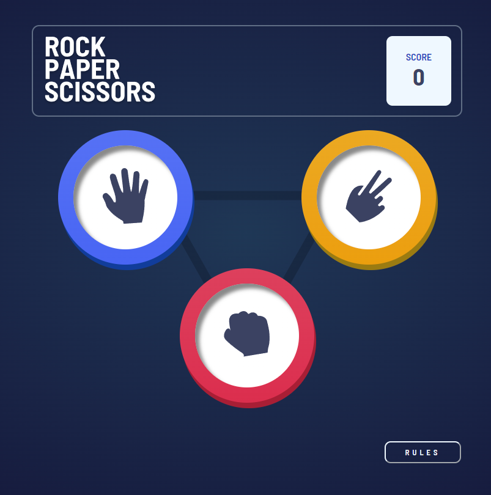
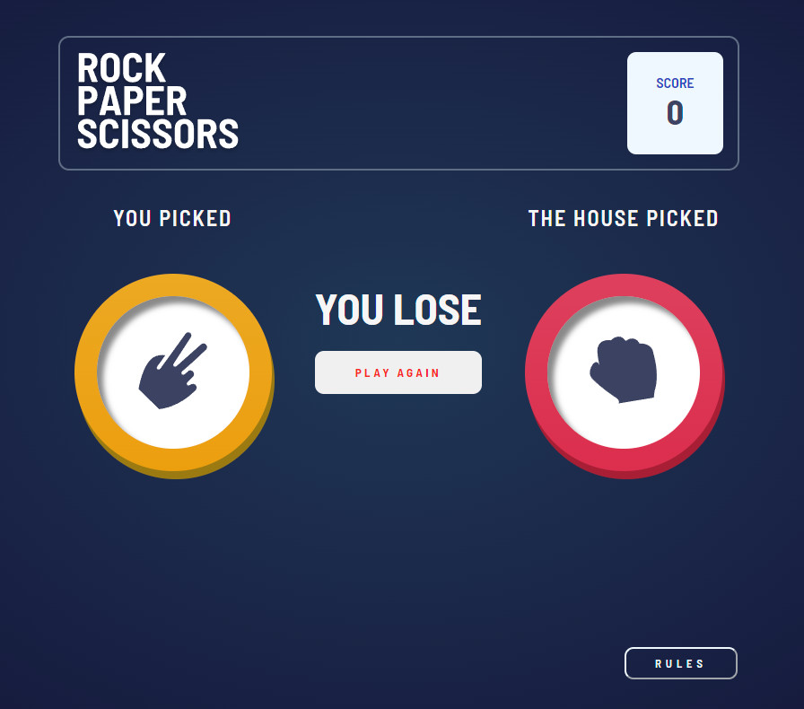
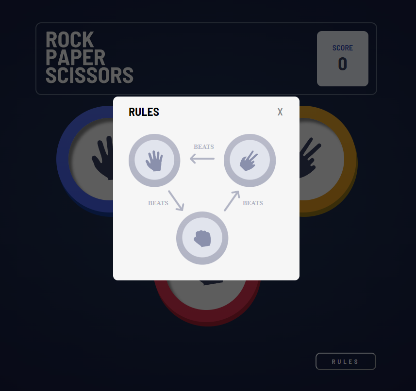
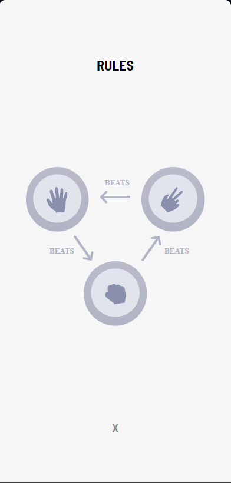

# Frontend Mentor - Rock, Paper, Scissors solution

This is a solution to the [Rock, Paper, Scissors challenge on Frontend Mentor](https://www.frontendmentor.io/challenges/rock-paper-scissors-game-pTgwgvgH). Frontend Mentor challenges help you improve your coding skills by building realistic projects.

## Table of contents

- [Overview](#overview)
  - [The challenge](#the-challenge)
  - [Screenshot](#screenshot)
  - [Links](#links)
- [My process](#my-process)
  - [Built with](#built-with)
  - [Continued development](#continued-development)
- [Author](#author)

## Overview

### The challenge

Users should be able to:

- View the optimal layout for the game depending on their device's screen size
- Play Rock, Paper, Scissors against the computer
- Maintain the state of the score after refreshing the browser (in progress)
- **Bonus**: Play Rock, Paper, Scissors, Lizard, Spock against the computer (in progress)

### Screenshot

### Links

- Live Site URL: [RockyPaper](https://rocky-paper-scissor.vercel.app/)

## My process

### Built with

- Semantic BEM HTML5 markup
- Flexbox
- CSS Grid
- Mobile-first workflow
- [React](https://reactjs.org/) - JS library
- TypeScript (in progress)

### Continued development

I want to improve the application and practice with typescript , plus implement the bonus side which is the addition of lizard and spock to the options as the frontendmentor exercise suggest with the 'bonus' part.

## Author

- Linkedin - [Adrian Mayor](https://www.linkedin.com/in/adrian-mayor-dev/)
- Twitter - [@AMayorDev](https://twitter.com/AMayorDev)
